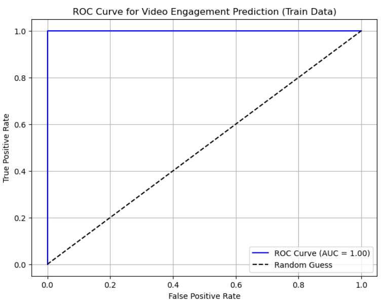

# 🎯 Video Engagement Prediction

This project uses machine learning to predict how engaging an educational video will be based on transcript, audio, and metadata features.

## 📊 Problem Statement

Engagement is critical for learning. We use features like `easiness`, `document_entropy`, and `speaker_speed` to predict if viewers will watch at least 30% of the video.

## 🧠 Models Used

- Random Forest Classifier
- XGBoost Classifier
- GridSearchCV for hyperparameter tuning
- ROC AUC for evaluation

## 📁 Project Structure

```
video-engagement-prediction/
├── data/
│   ├── train.csv
│   └── test.csv
├── scripts/
│   └── assignment4.py
├── notebooks/
├── visuals/
│   ├── roc_curve.png
│   └── feature_importance_comparison.png
├── LICENSE
├── README.md
├── requirements.txt
```

## 📌 Features

- `title_word_count`
- `document_entropy`
- `freshness`
- `easiness`
- `fraction_stopword_presence`
- `speaker_speed`
- `silent_period_rate`

## 🧪 Evaluation Metric

- ROC AUC Score (≥ 0.85 = high performance)
- Feature importance comparison (RandomForest vs. XGBoost)

## 🖼️ Sample Visuals

### ROC Curve



### Feature Importance Comparison


## 🔧 Run Locally

```bash
pip install -r requirements.txt
python scripts/assignment4.py
```

## 👨‍💻 Author

Mukesh Thenraj

## 📄 License

This project is licensed under the [MIT License](LICENSE).
